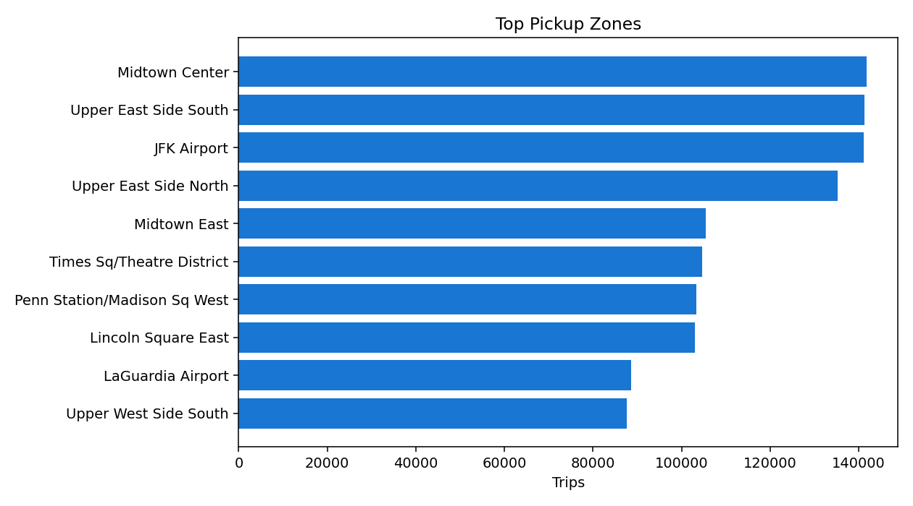
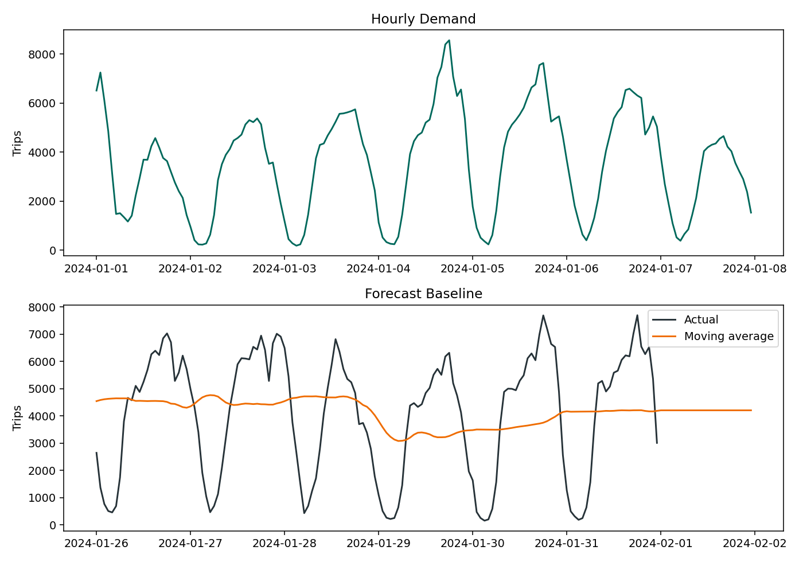
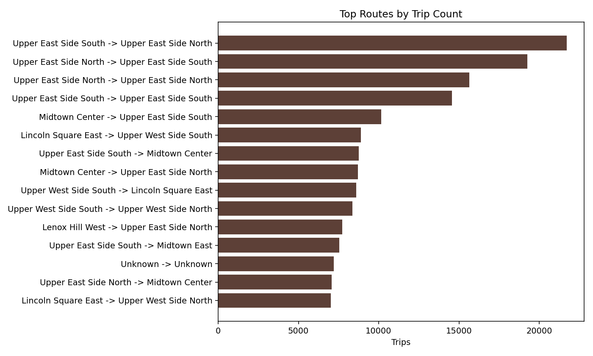
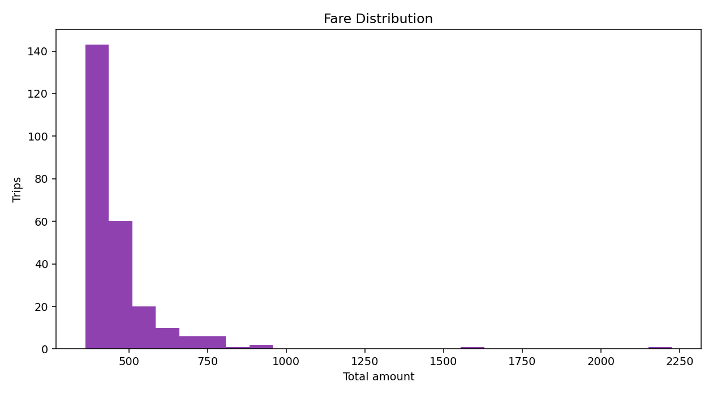

「NYC Taxi Mobility Analytics Platform 是一個城市交通資料工程與分析平台。它使用 NYC TLC Taxi Trip Records，展示 Parquet ingestion、partitioned analytical warehouse、time-series demand analysis、geospatial dashboard、fare / trip analytics、demand forecasting baseline 與 Next.js 查詢服務。」

# NYC Taxi Mobility Analytics Platform

This repository is a local-first analytics engineering project for NYC taxi mobility data. It ships with a deterministic sample Parquet generator so the full pipeline can run without downloading large public datasets.


## Quick Navigation

- [Quickstart](#quickstart)
- [Real NYC TLC Data](#real-nyc-tlc-data)
- [Demo Assets](#demo-assets)
- [Docker](#docker)
- [API Endpoints](#api-endpoints)
- [Resume Bullets](#resume-bullets)

## Data Engineering Focus

- Parquet ingestion for sample data and real NYC TLC Taxi Trip Records.
- Partitioned analytical warehouse using `year` and `month`.
- DuckDB views and tables for fast local OLAP queries.
- Data quality checks for row counts, required columns, timestamps, non-negative measures, and zone joins.
- Time-series demand analysis, route analytics, fare analytics, and baseline forecasting.
- Next.js App Router dashboard and Route Handlers on top of the same DuckDB warehouse.

## Quickstart

```bash
python -m pip install -r requirements.txt
npm install
make sample-data
make etl
make dq
make evaluate
make test
```

Generate portfolio demo images:

```bash
make demo-assets
```

Run the Next.js app and API:

```bash
make app
```

Open `http://localhost:3000`.

## Partition Strategy

The ETL writes trips to:

```text
data/warehouse/trips/year=YYYY/month=MM/trips.parquet
```

DuckDB reads this layout with Hive partitioning enabled, so `year` and `month` are available for filtering without storing large raw datasets in Git.

## DuckDB Usage

The warehouse database lives at `data/duckdb/taxi_analytics.duckdb`. ETL creates:

- `trips`
- `zones`
- `hourly_demand`
- `daily_revenue`
- `route_summary`
- `fare_features`
- `demand_forecast`

## Real NYC TLC Data

The downloader uses the official NYC TLC CloudFront public data paths linked from the TLC Trip Record Data page.

Default smoke test dataset:

- taxi type: yellow
- year: 2024
- month: 01
- expected file: `yellow_tripdata_2024-01.parquet`
- local raw path: `data/raw/tlc/yellow/year=2024/month=01/`

Download and process the default real dataset:

```bash
make real-smoke
```

Download only:

```bash
make download-real-data YEAR=2024 MONTH=01 TAXI_TYPE=yellow
```

Process downloaded real data:

```bash
make etl-real YEAR=2024 MONTH=01 TAXI_TYPE=yellow
```

Process a custom local TLC folder:

```bash
PYTHONPATH=src python -m nyc_taxi_mobility_analytics.etl \
  --input-dir /path/to/tlc/parquet/folder \
  --taxi-type yellow \
  --year 2024 \
  --month 1 \
  --zones data/raw/reference/taxi_zone_lookup.csv
```

Large Parquet files should stay outside the repo.

### TLC Schema Compatibility

The ETL normalizes common TLC yellow/green columns into the project schema:

- `VendorID` to `vendor_id`
- `tpep_pickup_datetime` / `lpep_pickup_datetime` to `pickup_datetime`
- `tpep_dropoff_datetime` / `lpep_dropoff_datetime` to `dropoff_datetime`
- `PULocationID` to `pickup_location_id`
- `DOLocationID` to `dropoff_location_id`
- optional surcharge fields including `congestion_surcharge`, `airport_fee`, and 2025+ `cbd_congestion_fee`

## Forecasting Baseline

The MVP includes:

- naive forecast
- moving average forecast
- MAE
- RMSE
- MAPE

Reports are written to `data/reports/evaluation_report.json`.

## API Endpoints

- `GET /health`
- `GET /analytics/overview`
- `GET /analytics/hourly-demand`
- `GET /analytics/top-zones`
- `GET /analytics/routes`
- `GET /analytics/od-matrix`
- `GET /analytics/airport-trips`
- `GET /analytics/fare-summary`
- `GET /analytics/tip-behavior`
- `GET /analytics/seasonality`
- `GET /analytics/peak-hours`
- `GET /forecast/demand`
- `GET /forecast/metrics`
- `GET /zones`
- `GET /trips/sample`
- `GET /trips/search`

## Dashboard Pages

- Overview
- Demand: hourly trend, weekday/hour heatmap, peak/off-peak summary, anomaly baseline
- Zones & routes: pickup/dropoff ranking, borough OD matrix, route matrix
- Fares & tips: fare distribution, revenue by borough, tip behavior, route revenue
- Trip Explorer: filterable and sortable trip-level table
- Forecast Lab: naive, moving average, and seasonal naive model comparison
- Zone Map: NYC taxi zone GeoJSON choropleth for pickup/dropoff demand or revenue

## Evaluation

```bash
make dq
make evaluate
PYTHONPATH=src python -m nyc_taxi_mobility_analytics.benchmark
```

Outputs:

- `data/reports/data_quality_report.json`
- `data/reports/evaluation_report.json`
- `data/reports/query_latency_benchmark.json`

## Demo Assets

Generated images are stored in `docs/assets/`:






## Docker

```bash
docker compose up --build
```

- Next.js app and API: `http://localhost:3000`

## Resume Bullets

- Built a local analytics engineering platform for NYC TLC taxi trips using Parquet, DuckDB, partitioned storage, and Next.js App Router.
- Designed reproducible sample data generation and real Parquet ingestion adapter for public large-scale taxi trip records.
- Implemented data quality checks, analytical marts, filterable KPI dashboards, zone/route OD analysis, demand heatmaps, trip explorer, and forecasting baselines with MAE/RMSE/MAPE evaluation.
- Exposed analytics through API endpoints and an interactive dashboard for mobility, revenue, fare, and demand forecasting workflows.
